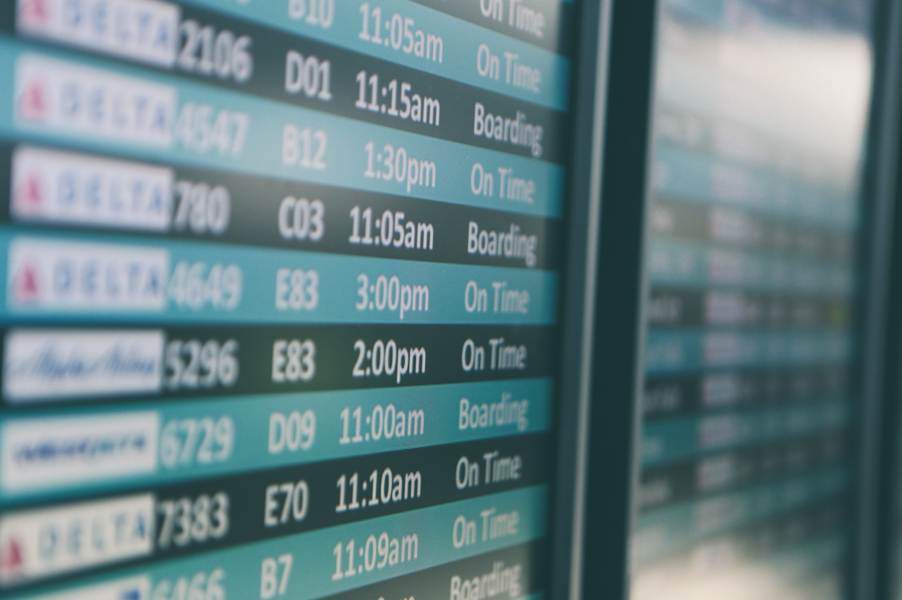
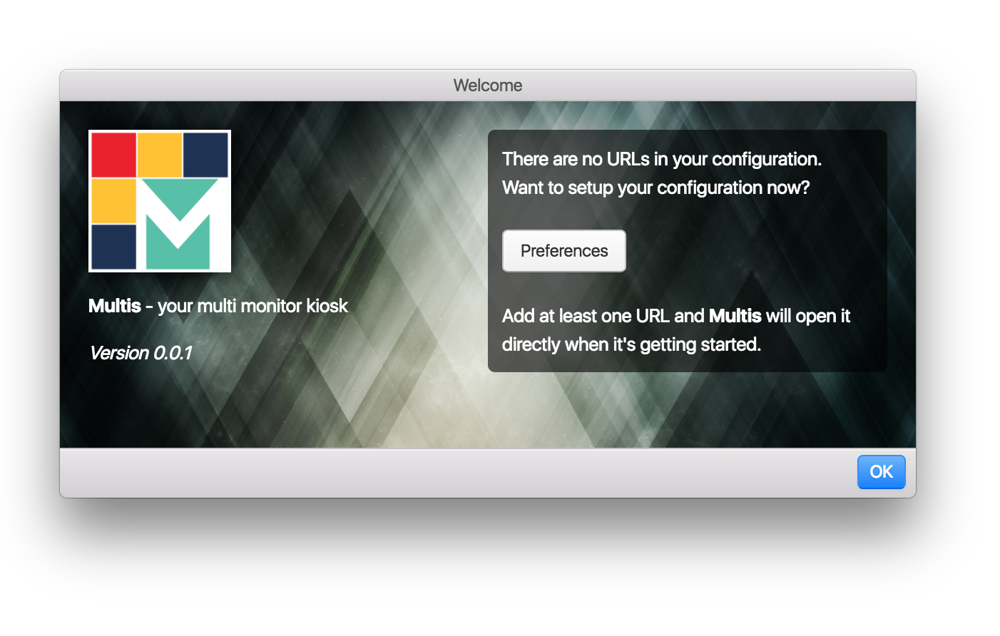
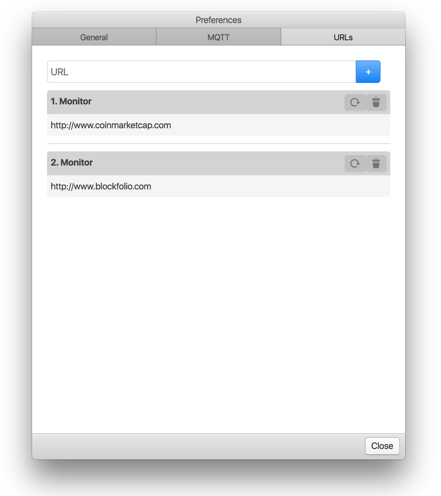

[](https://app.fossa.io/projects/git%2Bgithub.com%2Fddresch%2Fmultis?ref=badge_shield)
[](https://github.com/ddresch/multis/blob/master/LICENSE)
[](https://travis-ci.org/ddresch/multis)

# Multis Browser
This app helps to display HTML content on multiple displays connected to **one** machine.

## Use Case
You want to show your custom dashboards, selected websites or a timetable wall like the ones used on the airport using one machine and multiple monitors.


Photo by Matthew Smith on [Unsplash](https://unsplash.com/search/photos/airport-timetable?utm_source=unsplash&utm_medium=referral&utm_content=creditCopyText)

## Problem
First you think OK no big deal but if you start working on it, you'll see it's not that simple task.

See these postings as reference:

- [Blog Post by Oleksandr Tomin](https://alextomin.wordpress.com/2015/04/10/kiosk-mode-in-windows-chrome-on-multiple-displays/)
- [Still looking for driver independent solution](https://stackoverflow.com/questions/23234534/how-to-extend-chrome-browser-to-dual-display-on-fullscreen)

## Solution
Use Multis and setup you list of URLs to show on each attached display/monitor. Multis will open a browser instance for each URL in fullscreen mode on the corresponding monitor.

[DOWNLOAD LATEST RELEASE](https://github.com/ddresch/multis/releases/latest)





**Attention:** in current version you need to restart Multis after your initial URL setup.

*Features*
- Manage multiple monitor kiosk setup
- Connect with [MQTT](http://www.mqtt.org) server to remotely manage your kiosk

## Future Ideas
Growing list of ideas, other packages to integrate etc.

- [Pretty logger](https://github.com/sindresorhus/electron-timber) for development
- List of URLs sortable via Drag'n'Drop
- More options per URL or monitor (e.g. fullscreen optional)
- Switch to [electron-builder]()
- Extended MQTT interface
- you name it ...

## Get Started

Run Multis on your local machine.
```
npm install
npm start
```

Build for deployment (currently MAC only)
```
npm run build-mac
```

## License
[](https://app.fossa.io/projects/git%2Bgithub.com%2Fddresch%2Fmultis?ref=badge_large)
